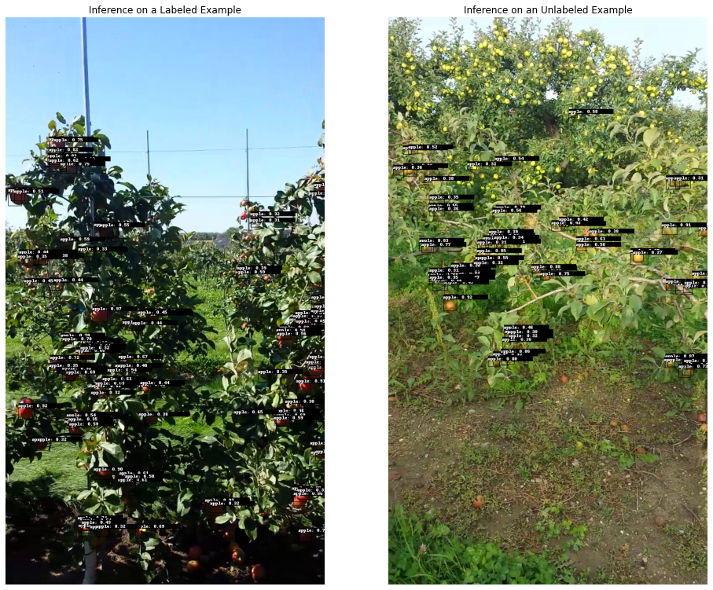

# Active Lerarning with the Nvidia TLT
Tutorial on active learning with the Nvidia Transfer Learning Toolkit (TLT).


In this tutorial, we will show you how you can do active learning for object detection with the [Nvidia Transfer Learning Toolkit](https://developer.nvidia.com/transfer-learning-toolkit). The task will be object detection of fruits at the plant. Accurately detecting and counting fruits is a critical step towards automating harvesting processes.
Furthermore, fruit counting can be used to project expected yield and hence to detect low yield years early on.

The structure of the tutorial is as follows:


1. [Prerequisites](#prerequisites)
    1. [Set up Lightly](#lightly)
    2. [Set up Nvidia TLT](#tlt)
    3. [Data](#data)
2. [Active Learning](#al)
    1. [Initial Sampling](#sampling)
    2. [Training and Inference](#training)
    3. [Active Learning Step](#alstep)
    4. [Re-training](#retraining)


To get started, clone this repository to your machine and change the directory.
```
git clone https://github.com/lightly-ai/NvidiaTLTActiveLearning.git
cd NvidiaTLTActiveLearning
```


## 1 Prerequisites <a name=prerequisites>

For this tutorial, we require Python 3.6 or higher. We also need to install [`lightly`](https://github.com/lightly-ai/lightly), `numpy` and `argparse`.
```
pip install -r requirements.txt
```


### 1.1 Set up Lightly <a name=lightly>
To set up lightly, head to the [Lightly web-app](https://app.lightly.ai) and create a free account by logging in. Make sure to get your token by clicking on your e-mail address and selecting "Preferences". You will need the token for the rest of this tutorial.

### 1.2 Set up Nvidia TLT <a name=tlt>
To install the Nvidia Transfer Learning Toolkit, follow [these instructions](https://docs.nvidia.com/metropolis/TLT/tlt-user-guide/text/requirements_and_installation.html). If you want to use your own scripts for training and inference, you can skip this part.

To make all relevant directories accessible to the Nvidia TLT, we need to mount the current working directory and the `yolo_v4/specs` directory to the Nvidia TLT docker. We do so with the `mount.py` script.

```
python mount.py
```

Next, we need to specify all training configurations. The Nvidia TLT expects all training configurations in a `.txt` file which is stored in the `yolo_v4/specs/` directory. For the purpose of this tutorial we provide an example in `yolo_v4_minneapple.txt`. The most important differences to the example script provided by Nvidia are:
- Anchor Shapes: We made the anchor boxes smaller since the largest bounding boxes in our dataset are only approximately 50 pixels wide.
- Augmentation Config: We set the output width and height of the augmentations to 704 and 1280 respectively. This corresponds to the shape of our images.
- Target Class Mapping: To do transfer learning, we made a target class mapping from `car` to `apple`. This means that everytime the model would now predict a car, it predicts an apple instead.

### 1.3 Data <a name=data>
We will use the [MinneApple fruit detection dataset](http://rsn.cs.umn.edu/index.php/MinneApple). It consists of 670 training images of apple trees, annotated for detection and segmentation. The dataset contains images of trees with red and green apples.
TODO download!

## 2 Active Learning <a name=al>
Now that our setup is complete, we can start the active learning loop. In general, the active learning loop will consist of the following steps:
1. Initial sampling: Get an initial set of images to annotate and train on.
2. Training and inference: Train on the labeled data and make predictions on all data.
3. Active learning query: Use the predictions to get the next set of images to annotate, go to 2.

We will walk you through all three steps in this tutorial.

To do active learning with Lightly, we need to upload our dataset to the platform. The command `lightly-magic` will train a self-supervised model to get good image representations and then uploads the images along with the image representations to the platform. If you want to skip training, you can set `trainer.max_epochs=0`. In the following command, replace `MY_TOKEN` with your own token from the platform.


```
lightly-magic \
    input_dir=./data/raw/images \
    trainer.max_epochs=0 \
    loader.num_workers=8 \
    collate.input_size=512 \
    new_dataset_name="MinneApple" \
    token=MY_TOKEN
```

The above command will display the id of your dataset. You will need this later in the tutorial.

Once the upload has finished, you can visually explore your dataset in the web-app.


### 2.1 Initial Sampling <a name=sampling>

Let's select an initial batch of images which we want to annotate.

Lightly offers different sampling strategies, the most prominent ones being `CORESET` and `RANDOM` sampling. `RANDOM` sampling will preserve the underlying distribution of your dataset well while `CORESET` maximizes the heterogeneity of your dataset. While exploring our dataset in the [web-app](https://app.lightly.ai), we noticed many different clusters therefore we choose `CORESET` sampling to make sure that every cluster is represented in the training data.

We use the `active_learning_query.py` script to make an initial selection:

```
python active_learning_query.py \
    --token YOUR_TOKEN \
    --dataset_id YOUR_DATASET_ID \
    --new_tag_name 'initial-selection' \
    --n_samples 100
    --method CORESET
```

The above script roughly performs the following steps:

It creates an API client in order to communicate with the Lightly API.

```python
# create an api client
client = ApiWorkflowClient(
    token=YOUR_TOKEN,
    dataset_id=YOUR_DATASET_ID,
)
```
Then, it creates an active learning agent which serves as an interface to do active learning.

```python
# create an active learning agent
al_agent = ActiveLearningAgent(client)
```

Finally, it creates a sampling configuration, makes an active learning query, and puts the annotated images into the `data/train` directory.

```python
# make an active learning query
cofnig = SamplerConfig(
    n_samples=100,
    method=SamplingMethod.CORESET,
    name='initial-selection',
)
al_agent.query(config)

# simulate annotation step by copying the data to the data/train directory 
oracle.annotate_images(al_agent.added_set)
```

The `query` will automatically create a new tag with the name `initial-selection` in the web-app.

You can verify that the number of annotated images is correct like this:
```
ls data/train/images | wc -l
ls data/train/labels | wc -l
```

### 2.2 Training and Inference <a name=training>
Now that we have our annotated training data, let's train an object detection model on it and see how well it works! We use the Nvidia Transfer Learning Toolkit which allows us to train a YOLOv4 object detector from the command line. The cool thing about transfer learning is that we don't have to train a model from scratch and so we require fewer annotated images to get good results.

Let's start by downloading a pre-trained object detection model from the Nvidia registry.

```
mkdir -p ./yolo_v4/pretrained_resnet18
ngc registry model download-version nvidia tlt_pretrained_object_detection:resnet18 \
    --dest ./yolo_v4/pretrained_resnet18
```

Finetuning the object detector on our sampled training data is as simple as the following command. Make sure to replace MY_KEY with the API token you get from your Nvidia account TODO.

```
mkdir -p $PWD/yolo_v4/experiment_dir_unpruned
tlt yolo_v4 train \
    -e /workspace/tlt-experiments/yolo_v4/specs/yolo_v4_minneapple.txt \
    -r /workspace/tlt-experiments/yolo_v4/experiment_dir_unpruned \
    --gpus 1 \
    -k MY_KEY
``` 

Now that we have finetuned the object detector on our dataset, we can do inference to see how well it works.

Doing inference on the whole dataset has the advantage that we can figure out for which images the model performs poorly or has a lot of uncertainties.

```
tlt yolo_v4 inference \
    -i /workspace/tlt-experiments/data/raw/images/ \
    -e /workspace/tlt-experiments/yolo_v4/specs/yolo_v4_minneapple.txt \
    -m /workspace/tlt-experiments/yolo_v4/experiment_dir_unpruned/weights/yolov4_resnet18_epoch_050.tlt \
    -o /workspace/tlt-experiments/infer_images \
    -l /workspace/tlt-experiments/infer_labels \
    -k MY_KEY
```

Below you can see two example images after training. It's evident that the model does not perform well on the unlabeled image. Therefore, we want to do add more samples to the training dataset.




### 2.3 Active Learning Step <a name=alstep>
We can use the inferences from the previous step to determine with which images the model has problems. With Lightly, we can easily select these images while at the same time making sure that our training dataset is not flooded with duplicates.

This section is about how to select the images which complete your training dataset. We can use the `active_learning_query.py` script again but this time we have to indicate that there already exists a set of preselected images and indicate where the inferences are stored so that the script can compute active learning scores.

Furthermore, we will use `CORAL` as a sampling method. `CORAL` simultaneously maximizes the diversity and the sum of the active learning scores in the sampled data. #Comment: it does not "maximize the diversity [...] of the active learning scores". Perhaps: "CORAL simultaneously chooses a diverse subset of images and images with high active learning scores."

```
python active_learning_query.py \
    --token YOUR_TOKEN \
    --dataset_id YOUR_DATASET_ID \
    --preselected_tag_name 'initial-selection' \
    --new_tag_name 'al-iteration-1' \
    --n_samples 200
    --method CORAL
```

The script works very similar to before but with one significant difference: This time, all the inferred labels are loaded and used to calculate an active learning score for each sample:

```python
# create a scorer to calculate active learning scores based on model outputs
scorer = ScorerObjectDetection(model_outputs)
```

The rest of the script is almost same as for the initial selection:

```python
# create an api client
client = ApiWorkflowClient(
    token=YOUR_TOKEN,
    dataset_id=YOUR_DATASET_ID,
)

# create an active learning agent and set the preselected tag
al_agent = ActiveLearningAgent(
    client,
    preselected_tag_name='initial-selection',
)

# create a sampler configuration
config = SamplerConfig(
    n_samples=200,
    method=SamplingMethod.CORAL,
    name='al-iteration-1',
)

# make an active learning query
al_agent.query(config, scorer)

# simulate the annotation step
oracle.annotate_images(al_agent.added_set)
```

As before, we can check the number of images in the training set:
```
ls data/train/images | wc -l
ls data/train/labels | wc -l
```

### 2.4 Re-training <a name=retraining>

We can re-train our object detector on the new dataset to get an even better model. For this, we can use the same command as before. If you want to continue training from the last checkpoint, make sure to replace the pretrain_model_path in the specs file by a resume_model_path:

```
tlt yolo_v4 train \
    -e /workspace/tlt-experiments/yolo_v4/specs/yolo_v4_minneapple.txt \
    -r /workspace/tlt-experiments/yolo_v4/experiment_dir_unpruned \
    --gpus 1 \
    -k MY_KEY
```

If you're still unhappy with the performance after re-training the model, you can repeat steps [2.2](#training) and [2.3](#alstep) and the re-train the model again.
